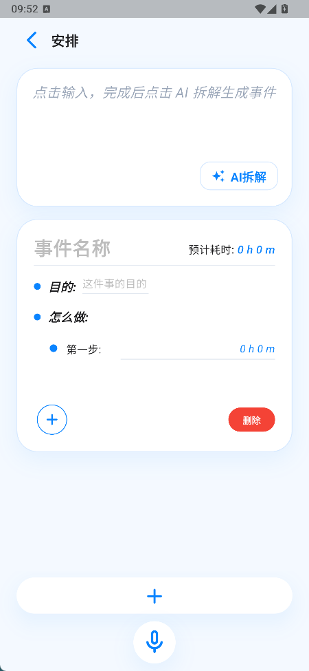

# 一刻 Yike

一刻是一款面向个人时间管理与任务执行的移动端应用，旨在帮助用户记录待办事件、拆解执行步骤，并通过番茄钟、历史记录和数据导出等功能，辅助用户完成任务复盘与时间分析。

本项目采用 Flutter 开发移动端界面，后端使用 FastAPI 提供部分数据处理与智能拆解接口，数据存储以本地 SQLite 为主。

## 项目截图

| AI 任务录入                              | 事件安排                               | 番茄钟                                  |
| ---------------------------------------- | -------------------------------------- | --------------------------------------- |
|  |  |  |

## 核心功能

当前主要功能包括：

- **AI 任务拆解**：支持用户通过自然语言输入任务，由后端调用大模型解析为结构化事件、执行步骤和预计耗时。
- **事件管理**：支持事件创建、编辑、查看、完成、软删除与恢复，并可记录事件目的、步骤、四象限分类和日程信息。
- **时间安排**：支持将事件安排到指定日期和时间段，并通过安排页管理待办事件和事件优先级。
- **番茄钟专注**：支持围绕具体事件启动专注计时，记录专注时长、打断事项、临时想法和步骤完成情况。
- **本地持久化**：使用SQLite保存事件、步骤、番茄钟记录和模板数据，支持移动端离线使用。
- **任务模板**：支持创建阶段化事件模板，并基于模板生成可执行事件，沉淀重复性任务流程。

## 技术栈

| 模块             | 技术选型                             |
| ---------------- | ------------------------------------ |
| 移动端开发       | Flutter, Dart                        |
| 本地数据存储     | SQLite, sqflite                      |
| 后端服务         | Python, FastAPI, Uvicorn             |
| 数据库ORM        | SQLAlchemy                           |
| 数据结构化与校验 | Pydantic                             |
| AI 任务解析      | OpenAI-compatible API / DeepSeek API |
| 前后端通信       | RESTful API, HTTP                    |
| 配置与跨域       | 环境变量, CORS                       |
| 测试与调试       | flutter_test, sqflite_common_ffi     |

## 项目结构

```text
yike/
├── backend/              # FastAPI 后端服务
│   ├── main.py           # 应用入口
│   ├── routers/          # API 路由
│   ├── services/         # AI 解析等业务服务
│   ├── models.py         # 数据模型与接口模型
│   ├── database.py       # 数据库初始化与连接
│   └── requirements.txt  # 后端依赖
│
├── frontend/             # Flutter 移动端
│   ├── lib/
│   │   ├── models/       # 数据模型
│   │   ├── repositories/ # 数据访问层
│   │   ├── services/     # API 与本地数据库
│   │   ├── screens/      # 页面模块
│   │   └── shared/       # 公共工具与常量
│   ├── test/             # 测试代码
│   ├── assets/           # 静态资源
│   └── pubspec.yaml      # Flutter 依赖配置
│
└── README.md
```

## 系统架构

当前版本采用“移动端本地存储 + 后端 AI 解析服务”的架构。移动端负责页面交互、事件管理、时间安排、番茄钟计时和本地数据持久化；后端主要负责自然语言任务解析，并为后续数据同步和 AI 能力扩展预留接口能力。

```text
用户输入任务
    ↓
Flutter 移动端
    ↓
FastAPI 后端
    ↓
大模型 API
    ↓
结构化事件与步骤
    ↓
返回移动端本地 SQLite 保存与展示
    ↓
事件安排 / 番茄钟记录 / 后续数据分析
```

在当前阶段，SQLite 主要承担移动端本地业务数据存储，保证事件管理、番茄钟记录和模板等基础功能可以离线使用；后端主要承担 AI 任务解析、基础事件接口和后续云同步能力预留。

## 后端接口说明

后端基于 FastAPI 实现，当前主要用于 AI 任务解析、结构化数据返回和后续云端能力扩展。完整接口说明见：

[后端接口文档](./docs/api.md)

FastAPI 默认提供交互式接口文档，后端服务启动后可通过以下地址查看：

```text
http://127.0.0.1:8000/docs
```

## 环境要求

- Flutter SDK
- Dart SDK
- Python 3.10+
- Android Studio / Android 模拟器 或真实设备
- 可用的 OpenAI-compatible API Key

## 本地运行

### 1. 启动后端

进入后端目录：

```bash
cd backend
```

安装依赖：

```bash
pip install -r requirements.txt
```

配置环境变量。PowerShell示例：

```bash
$env:OPENAI_API_KEY="your-api-key"
$env:AI_BASE_URL="https://api.deepseek.com"
$env:AI_MODEL="deepseek-v4-flash"
$env:API_TOKEN="dev-token"
```

启动FastAPI服务：

```bash
python -m uvicorn main:app --reload --host 127.0.0.1 --port 8000
```

启动后可以访问接口文档：

```text
http://127.0.0.1:8000/docs
```

如果没有设置 `API_TOKEN`，后端会跳过接口鉴权；如果设置了 `API_TOKEN`，前端请求也需要传入相同 token。

后端主要环境变量：

| 变量             | 说明                         |
| ---------------- | ---------------------------- |
| `OPENAI_API_KEY` | 大模型 API Key               |
| `AI_BASE_URL`    | OpenAI-compatible API 地址   |
| `AI_MODEL`       | 使用的模型名称               |
| `API_TOKEN`      | 后端接口访问 Token，可选     |
| `DATABASE_URL`   | 后端 SQLite 数据库地址，可选 |
| `CORS_ORIGINS`   | 允许跨域访问的来源           |

### 2. 启动前端

进入前端目录：

```bash
cd frontend
```

安装依赖：

```bash
flutter pub get
```

启动应用：

```bash
flutter run --dart-define=API_BASE_URL=http://127.0.0.1:8000/api --dart-define=API_TOKEN=dev-token
```

如果使用 Android 模拟器访问本机后端，可以先执行：

```bash
adb reverse tcp:8000 tcp:8000
```

然后继续使用：

```bash
--dart-define=API_BASE_URL=http://127.0.0.1:8000/api
```

## 数据设计概览

项目当前采用「移动端本地 SQLite + 后端 SQLite」的轻量数据方案。移动端负责主要业务数据持久化，后端当前主要用于 AI 任务解析和基础事件接口，为后续云端同步预留扩展空间。

### 移动端本地数据

移动端使用 SQLite 保存核心业务数据，当前主要包括以下几类：

| 数据模块     | 说明                                                         |
| :----------- | ------------------------------------------------------------ |
| 事件数据     | 保存任务标题、目的、状态、日程安排、四象限分类、预计耗时、完成状态等信息 |
| 步骤数据     | 保存事件下的执行步骤、步骤顺序、预计耗时和完成记录           |
| 番茄钟数据   | 保存专注会话、专注时长、番茄数量和历史记录                   |
| 打断与想法   | 保存专注过程中的打断事项、临时想法，以及想法转入事件箱的状态 |
| 模板数据     | 保存任务模板、阶段、阶段事件、步骤和注意事项                 |
| 模板部署数据 | 保存模板部署状态、阶段进度，以及由模板生成的事件映射关系     |

### 后端数据

后端使用 SQLAlchemy 管理 SQLite 数据表，后端数据库当前主要用于 AI 解析后的结构化事件存储和基础事件接口，详细表结构见 [数据设计文档](./docs/schema.md)。

## 项目亮点

- **AI 与任务录入流程结合**  
  将大模型能力接入任务录入流程，把自然语言任务自动拆解为结构化事件、步骤和预计耗时，降低用户手动规划成本。

- **完整的任务执行闭环**  
  围绕「任务录入 → 任务安排 → 专注执行 → 结果记录」设计核心链路，而不是只停留在待办列表或计时工具。

- **移动端本地优先架构**  
  核心业务数据优先保存在本地 SQLite 中，支持离线使用，并降低早期版本对后端服务的依赖。

- **结构化番茄钟记录**  
  番茄钟不仅记录时间，还关联具体任务、执行步骤、打断事项和临时想法，为后续复盘和数据分析提供基础。

- **模板化任务流程**  
  支持将重复性任务沉淀为阶段化模板，并基于模板生成可执行事件，适合学习计划、项目流程等周期性任务场景。

- **前后端职责清晰**  
  后端负责 AI 解析、基础事件接口和配置管理，移动端负责主要业务交互、本地持久化和任务执行流程，便于后续扩展云同步能力。

## 当前进度

项目目前处于 MVP 迭代阶段，已完成 AI 任务拆解、事件管理、时间安排、番茄钟记录和本地 SQLite 持久化等核心链路。

已完成 / 基础可用：

- AI 自然语言任务解析
- 事件创建、编辑、完成与软删除
- 日程安排与四象限管理
- 番茄钟专注记录
- 打断事项、临时想法和历史记录
- 移动端SQLite本地持久化
- FastAPI后端基础服务

持续迭代中：

- 模板系统完整业务闭环
- 原生数据统计与复盘分析
- 后端云同步功能
- 更完整的测试覆盖和部署文档

## 说明

本项目是个人学习与求职展示项目，仍处于持续迭代阶段。当前版本优先保证核心链路可运行和可解释，部分模块仍在开发中。
