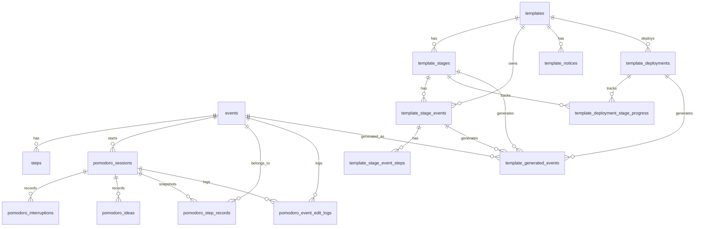

# 数据设计文档

本文档说明一刻 Yike 当前版本的数据设计。项目采用「移动端本地 SQLite 为主、后端 SQLite 为辅」的方案：移动端保存主要业务数据，后端当前主要承载 AI 任务解析和基础事件接口，并为后续云端同步预留空间。

## 1. 设计目标

当前数据设计围绕以下目标展开：

- **本地优先**：核心业务数据保存在移动端 SQLite 中，支持离线使用，降低 MVP 阶段对后端服务的依赖。
- **事件为中心**：任务、日程、番茄钟、模板生成结果都围绕 `events` 组织，便于后续统计和同步。
- **过程可沉淀**：番茄钟不仅保存计时结果，还保存打断、想法、步骤完成记录和编辑痕迹。
- **模板可复用**：模板数据拆分为模板、阶段、阶段事件、步骤和部署进度，支持重复性任务流程沉淀。
- **迁移可迭代**：移动端通过版本号、列迁移、表迁移和 `onOpen` schema 补齐保证旧版本数据可升级。

## 2. 数据存储概览

### 2.1 移动端本地数据库

移动端使用 `sqflite` 管理 SQLite 数据库，数据库文件名为：

```text
yike.db
```

当前移动端 schema version：

```text
9
```

移动端数据库是当前主要业务数据源，覆盖：

- 事件与步骤
- 日程安排与四象限分类
- 番茄钟会话、打断、想法、步骤记录
- 模板草稿、模板结构、模板部署和部署进度

### 2.2 后端数据库

后端使用 SQLAlchemy 管理 SQLite 数据库。后端数据库当前主要用于：

- AI 解析后的基础事件存储
- 基础事件 CRUD 接口
- 为后续云端同步和多端数据管理预留基础模型

当前前端主要业务仍以本地 SQLite 为主，后端数据模型相对更轻量。

## 3. 移动端核心关系图



## 4. 移动端数据表

### 4.1 `events`

事件主表，是项目最核心的数据表。AI 拆解结果、用户手动创建任务、模板生成任务最终都会沉淀为事件。

| 字段 | 类型 | 约束 / 默认值 | 说明 |
| --- | --- | --- | --- |
| `id` | `INTEGER` | `PRIMARY KEY AUTOINCREMENT` | 事件 ID |
| `title` | `TEXT` | `NOT NULL DEFAULT ''` | 事件标题 |
| `summary` | `TEXT` | `DEFAULT ''` | 事件摘要 |
| `purpose` | `TEXT` | `DEFAULT ''` | 事件目的 |
| `review` | `TEXT` | `DEFAULT ''` | 任务复盘内容 |
| `status` | `TEXT` | `NOT NULL DEFAULT 'inbox'` | 事件状态，如 `inbox`、`completed` |
| `quadrant` | `TEXT` | 可空 | 四象限分类 |
| `scheduled_date` | `TEXT` | 可空 | 安排日期 |
| `time_slot` | `TEXT` | 可空 | 时间段 |
| `calendar_order` | `INTEGER` | `NOT NULL DEFAULT 0` | 同一日程区域内的排序 |
| `total_minutes` | `INTEGER` | 可空 | 手动或 AI 给出的预计总耗时 |
| `actual_minutes` | `INTEGER` | 可空 | 实际完成耗时 |
| `tomato_count` | `INTEGER` | `NOT NULL DEFAULT 0` | 事件累计番茄数 |
| `created_at` | `TEXT` | 可空 | 创建时间，ISO-8601 字符串 |
| `updated_at` | `TEXT` | 可空 | 更新时间，ISO-8601 字符串 |
| `completed_at` | `TEXT` | 可空 | 完成时间 |
| `deleted_at` | `TEXT` | 可空 | 软删除时间 |

设计说明：

- `deleted_at` 用于软删除，默认查询只返回未删除事件。
- `total_minutes` 是可覆盖的总耗时；如果为空，前端会根据步骤预计耗时求和。
- `actual_minutes` 和 `tomato_count` 由番茄钟流程回写，用于后续统计和复盘。
- `scheduled_date`、`time_slot`、`calendar_order` 支持安排页的日期、时间段和拖拽排序。

### 4.2 `steps`

事件步骤表，用于保存事件拆解后的执行步骤。

| 字段 | 类型 | 约束 / 默认值 | 说明 |
| --- | --- | --- | --- |
| `id` | `INTEGER` | `PRIMARY KEY AUTOINCREMENT` | 步骤 ID |
| `event_id` | `INTEGER` | `NOT NULL`，关联 `events.id` | 所属事件 |
| `step_order` | `INTEGER` | `NOT NULL DEFAULT 1` | 步骤顺序 |
| `description` | `TEXT` | `DEFAULT ''` | 步骤描述 |
| `estimated_min` | `INTEGER` | `DEFAULT 0` | 预计耗时，单位分钟 |
| `completed_at` | `TEXT` | 可空 | 步骤完成时间 |

设计说明：

- 一个事件可以包含多个步骤。
- 保存事件时，当前实现会删除旧步骤并重新写入新步骤，保证步骤列表与事件编辑结果一致。
- `completed_at` 可由番茄钟步骤记录回填，用于展示步骤完成状态。

## 5. 番茄钟相关数据表

### 5.1 `pomodoro_sessions`

番茄钟会话表，记录一次围绕事件启动的专注过程。

| 字段 | 类型 | 约束 / 默认值 | 说明 |
| --- | --- | --- | --- |
| `id` | `INTEGER` | `PRIMARY KEY AUTOINCREMENT` | 会话 ID |
| `event_id` | `INTEGER` | `NOT NULL`，关联 `events.id` | 关联事件 |
| `start_time` | `TEXT` | 可空 | 开始时间 |
| `end_time` | `TEXT` | 可空 | 结束时间 |
| `status` | `TEXT` | `NOT NULL DEFAULT 'running'` | 计时状态 |
| `duration_sec` | `INTEGER` | `NOT NULL DEFAULT 0` | 已专注秒数 |
| `planned_minutes_snapshot` | `INTEGER` | 可空 | 启动时的计划耗时快照 |
| `tomato_count` | `INTEGER` | `NOT NULL DEFAULT 0` | 当前会话折算番茄数 |
| `created_at` | `TEXT` | 可空 | 创建时间 |
| `updated_at` | `TEXT` | 可空 | 更新时间 |

设计说明：

- `planned_minutes_snapshot` 保存启动番茄钟时的计划耗时，避免后续修改事件后影响历史记录。
- `duration_sec` 使用秒级记录，展示时再换算为分钟或番茄数。
- 当前模型状态包括 `running`、`paused`、`finishing`、`completed`、`idle` 等，数据库使用文本保存。

### 5.2 `pomodoro_interruptions`

专注打断记录表。

| 字段 | 类型 | 约束 / 默认值 | 说明 |
| --- | --- | --- | --- |
| `id` | `INTEGER` | `PRIMARY KEY AUTOINCREMENT` | 打断记录 ID |
| `session_id` | `INTEGER` | `NOT NULL`，关联 `pomodoro_sessions.id` | 所属会话 |
| `reason` | `TEXT` | `DEFAULT ''` | 打断原因 |
| `elapsed_sec` | `INTEGER` | `NOT NULL DEFAULT 0` | 打断发生时的已专注秒数 |
| `created_at` | `TEXT` | 可空 | 记录时间 |
| `resolved` | `INTEGER` | `NOT NULL DEFAULT 0` | 是否已处理，0/1 |
| `resolved_at` | `TEXT` | 可空 | 处理时间 |

设计说明：

- 打断记录用于复盘专注质量。
- `elapsed_sec` 能定位打断发生在专注过程的哪个阶段。

### 5.3 `pomodoro_ideas`

专注过程中的临时想法记录表。

| 字段 | 类型 | 约束 / 默认值 | 说明 |
| --- | --- | --- | --- |
| `id` | `INTEGER` | `PRIMARY KEY AUTOINCREMENT` | 想法 ID |
| `session_id` | `INTEGER` | `NOT NULL`，关联 `pomodoro_sessions.id` | 所属会话 |
| `content` | `TEXT` | `DEFAULT ''` | 想法内容 |
| `elapsed_sec` | `INTEGER` | `NOT NULL DEFAULT 0` | 想法产生时的已专注秒数 |
| `created_at` | `TEXT` | 可空 | 记录时间 |
| `added_to_inbox` | `INTEGER` | `NOT NULL DEFAULT 0` | 是否已加入事件箱，0/1 |
| `inbox_handled` | `INTEGER` | `NOT NULL DEFAULT 0` | 是否已做入箱决策，0/1 |
| `inbox_event_id` | `INTEGER` | 可空 | 转入事件箱后生成的事件 ID |

设计说明：

- `added_to_inbox` 表示是否真的生成了事件。
- `inbox_handled` 表示用户是否已经处理过这个想法，避免同一想法反复提示。
- `inbox_event_id` 当前是逻辑关联事件 ID，未在 DDL 中声明外键。

### 5.4 `pomodoro_step_records`

番茄钟步骤执行快照表。

| 字段 | 类型 | 约束 / 默认值 | 说明 |
| --- | --- | --- | --- |
| `id` | `INTEGER` | `PRIMARY KEY AUTOINCREMENT` | 记录 ID |
| `session_id` | `INTEGER` | `NOT NULL`，关联 `pomodoro_sessions.id` | 所属会话 |
| `event_id` | `INTEGER` | `NOT NULL`，关联 `events.id` | 所属事件 |
| `step_order` | `INTEGER` | `NOT NULL` | 步骤顺序 |
| `description_snapshot` | `TEXT` | `DEFAULT ''` | 步骤描述快照 |
| `estimated_min_snapshot` | `INTEGER` | `DEFAULT 0` | 步骤预计耗时快照 |
| `completed_at` | `TEXT` | 可空 | 步骤完成时间 |
| `elapsed_sec` | `INTEGER` | `NOT NULL DEFAULT 0` | 完成时的已专注秒数 |
| `duration_sec` | `INTEGER` | 可空 | 该步骤实际耗时 |

设计说明：

- 使用快照字段保存番茄钟启动时的步骤信息，避免事件后续编辑影响历史记录。
- 步骤完成记录可以回填到 `steps.completed_at`，使事件详情和专注历史保持一致。

### 5.5 `pomodoro_event_edit_logs`

番茄钟历史编辑日志表，用于记录用户在历史详情中对事件信息的修改痕迹。

| 字段 | 类型 | 约束 / 默认值 | 说明 |
| --- | --- | --- | --- |
| `id` | `INTEGER` | `PRIMARY KEY AUTOINCREMENT` | 日志 ID |
| `event_id` | `INTEGER` | `NOT NULL`，关联 `events.id` | 关联事件 |
| `session_id` | `INTEGER` | 可空，关联 `pomodoro_sessions.id` | 关联会话 |
| `target_type` | `TEXT` | `NOT NULL` | 编辑目标，如目的、步骤描述、步骤耗时 |
| `step_order` | `INTEGER` | 可空 | 被编辑步骤顺序 |
| `first_value` | `TEXT` | `DEFAULT ''` | 首次编辑前的值 |
| `latest_value` | `TEXT` | `DEFAULT ''` | 最近一次编辑后的值 |
| `first_edited_at` | `TEXT` | 可空 | 首次编辑时间 |
| `last_edited_at` | `TEXT` | 可空 | 最近编辑时间 |

约束：

```sql
UNIQUE(event_id, session_id, target_type, step_order)
```

设计说明：

- 该表用于保留历史编辑轨迹，辅助复盘实际执行与原计划之间的差异。
- 对 `step_order` 为空的记录，代码层会先查询再更新，避免重复写入。

## 6. 模板相关数据表

模板系统用于沉淀重复性任务流程。整体结构为：

```text
模板 -> 阶段 -> 阶段事件 -> 阶段事件步骤
模板 -> 注意事项
模板 -> 部署记录 -> 阶段进度 -> 生成事件映射
```

### 6.1 `templates`

模板主表。

| 字段 | 类型 | 约束 / 默认值 | 说明 |
| --- | --- | --- | --- |
| `id` | `INTEGER` | `PRIMARY KEY AUTOINCREMENT` | 模板 ID |
| `name` | `TEXT` | `NOT NULL DEFAULT ''` | 模板名称 |
| `goal` | `TEXT` | `NOT NULL DEFAULT ''` | 模板目标 |
| `source` | `TEXT` | `NOT NULL DEFAULT 'user'` | 来源：`user`、`official`、`public_user` |
| `status` | `TEXT` | `NOT NULL DEFAULT 'draft'` | 状态：`draft`、`published`、`archived` |
| `relation` | `TEXT` | 可空 | 阶段关系：`linear`、`parallel` |
| `current_create_step` | `INTEGER` | `NOT NULL DEFAULT 1` | 创建流程当前步骤 |
| `current_stage_index` | `INTEGER` | `NOT NULL DEFAULT 0` | 创建流程当前阶段索引 |
| `create_completed` | `INTEGER` | `NOT NULL DEFAULT 0` | 创建流程是否完成，0/1 |
| `created_at` | `TEXT` | 可空 | 创建时间 |
| `updated_at` | `TEXT` | 可空 | 更新时间 |
| `published_at` | `TEXT` | 可空 | 发布时间 |

设计说明：

- `source` 用于区分用户模板、官方模板和公开用户模板。
- `relation` 决定部署时阶段推进方式：线性模板自动推进，平行模板需要手动启用阶段。
- 创建流程状态保存在模板主表中，支持草稿恢复。

### 6.2 `template_stages`

模板阶段表。

| 字段 | 类型 | 约束 / 默认值 | 说明 |
| --- | --- | --- | --- |
| `id` | `INTEGER` | `PRIMARY KEY AUTOINCREMENT` | 阶段 ID |
| `template_id` | `INTEGER` | `NOT NULL`，关联 `templates.id` | 所属模板 |
| `stage_order` | `INTEGER` | `NOT NULL DEFAULT 1` | 阶段顺序 |
| `name` | `TEXT` | `NOT NULL DEFAULT ''` | 阶段名称 |
| `goal` | `TEXT` | `NOT NULL DEFAULT ''` | 阶段目标 |
| `estimated_minutes` | `INTEGER` | `NOT NULL DEFAULT 0` | 阶段预计耗时 |
| `created_at` | `TEXT` | 可空 | 创建时间 |
| `updated_at` | `TEXT` | 可空 | 更新时间 |

### 6.3 `template_stage_events`

模板阶段事件表。

| 字段 | 类型 | 约束 / 默认值 | 说明 |
| --- | --- | --- | --- |
| `id` | `INTEGER` | `PRIMARY KEY AUTOINCREMENT` | 阶段事件 ID |
| `template_id` | `INTEGER` | `NOT NULL`，关联 `templates.id` | 所属模板 |
| `stage_id` | `INTEGER` | `NOT NULL`，关联 `template_stages.id` | 所属阶段 |
| `event_order` | `INTEGER` | `NOT NULL DEFAULT 1` | 阶段内事件顺序 |
| `title` | `TEXT` | `NOT NULL DEFAULT ''` | 事件标题 |
| `purpose` | `TEXT` | `NOT NULL DEFAULT ''` | 事件目的 |
| `estimated_minutes` | `INTEGER` | `NOT NULL DEFAULT 0` | 预计耗时 |
| `created_at` | `TEXT` | 可空 | 创建时间 |
| `updated_at` | `TEXT` | 可空 | 更新时间 |

设计说明：

- 表内同时保存 `template_id` 和 `stage_id`，方便按模板直接查询，也能保持阶段归属。

### 6.4 `template_stage_event_steps`

模板阶段事件步骤表。

| 字段 | 类型 | 约束 / 默认值 | 说明 |
| --- | --- | --- | --- |
| `id` | `INTEGER` | `PRIMARY KEY AUTOINCREMENT` | 模板步骤 ID |
| `template_event_id` | `INTEGER` | `NOT NULL`，关联 `template_stage_events.id` | 所属阶段事件 |
| `step_order` | `INTEGER` | `NOT NULL DEFAULT 1` | 步骤顺序 |
| `description` | `TEXT` | `NOT NULL DEFAULT ''` | 步骤描述 |
| `estimated_minutes` | `INTEGER` | `NOT NULL DEFAULT 0` | 步骤预计耗时 |

### 6.5 `template_notices`

模板注意事项表。

| 字段 | 类型 | 约束 / 默认值 | 说明 |
| --- | --- | --- | --- |
| `id` | `INTEGER` | `PRIMARY KEY AUTOINCREMENT` | 注意事项 ID |
| `template_id` | `INTEGER` | `NOT NULL`，关联 `templates.id` | 所属模板 |
| `notice_order` | `INTEGER` | `NOT NULL DEFAULT 1` | 展示顺序 |
| `content` | `TEXT` | `NOT NULL DEFAULT ''` | 注意事项内容 |

### 6.6 `template_deployments`

模板部署表。每一次部署代表一次从模板到真实事件的执行计划。

| 字段 | 类型 | 约束 / 默认值 | 说明 |
| --- | --- | --- | --- |
| `id` | `INTEGER` | `PRIMARY KEY AUTOINCREMENT` | 部署 ID |
| `template_id` | `INTEGER` | `NOT NULL`，关联 `templates.id` | 来源模板 |
| `status` | `TEXT` | `NOT NULL DEFAULT 'not_started'` | 部署状态：`not_started`、`active`、`completed` |
| `active_stage_id` | `INTEGER` | 可空，关联 `template_stages.id` | 当前激活阶段 |
| `pause_after_current_stage` | `INTEGER` | `NOT NULL DEFAULT 0` | 当前阶段后是否暂停，0/1 |
| `deployed_at` | `TEXT` | 可空 | 部署时间 |
| `enabled_at` | `TEXT` | 可空 | 启用时间 |
| `completed_at` | `TEXT` | 可空 | 完成时间 |
| `created_at` | `TEXT` | 可空 | 创建时间 |
| `updated_at` | `TEXT` | 可空 | 更新时间 |

设计说明：

- `not_started` 表示已部署但未启用。
- `active` 表示正在执行。
- `completed` 表示部署生成的事件全部完成。

### 6.7 `template_deployment_stage_progress`

模板部署阶段进度表。

| 字段 | 类型 | 约束 / 默认值 | 说明 |
| --- | --- | --- | --- |
| `id` | `INTEGER` | `PRIMARY KEY AUTOINCREMENT` | 进度记录 ID |
| `deployment_id` | `INTEGER` | `NOT NULL`，关联 `template_deployments.id` | 所属部署 |
| `stage_id` | `INTEGER` | `NOT NULL`，关联 `template_stages.id` | 所属阶段 |
| `status` | `TEXT` | `NOT NULL DEFAULT 'locked'` | 阶段状态：`locked`、`in_progress`、`completed` |
| `completed_event_count` | `INTEGER` | `NOT NULL DEFAULT 0` | 已完成事件数 |
| `total_event_count` | `INTEGER` | `NOT NULL DEFAULT 0` | 阶段总事件数 |
| `elapsed_minutes` | `INTEGER` | `NOT NULL DEFAULT 0` | 阶段累计用时 |
| `started_at` | `TEXT` | 可空 | 阶段开始时间 |
| `completed_at` | `TEXT` | 可空 | 阶段完成时间 |
| `updated_at` | `TEXT` | 可空 | 更新时间 |

约束：

```sql
UNIQUE(deployment_id, stage_id)
```

设计说明：

- 每个部署的每个阶段只有一条进度记录。
- 进度通过已生成事件和已完成事件数量同步刷新。

### 6.8 `template_generated_events`

模板生成事件映射表，用于记录模板阶段事件生成了哪个真实事件。

| 字段 | 类型 | 约束 / 默认值 | 说明 |
| --- | --- | --- | --- |
| `id` | `INTEGER` | `PRIMARY KEY AUTOINCREMENT` | 映射 ID |
| `deployment_id` | `INTEGER` | `NOT NULL`，关联 `template_deployments.id` | 所属部署 |
| `stage_id` | `INTEGER` | `NOT NULL`，关联 `template_stages.id` | 来源阶段 |
| `template_event_id` | `INTEGER` | `NOT NULL`，关联 `template_stage_events.id` | 来源模板事件 |
| `event_id` | `INTEGER` | `NOT NULL`，关联 `events.id` | 生成的真实事件 |
| `status` | `TEXT` | `NOT NULL DEFAULT 'active'` | 映射状态 |
| `created_at` | `TEXT` | 可空 | 创建时间 |
| `updated_at` | `TEXT` | 可空 | 更新时间 |

约束：

```sql
UNIQUE(deployment_id, template_event_id, event_id)
```

设计说明：

- 该表是模板系统和事件系统之间的桥梁。
- 重置部署时，会将已生成事件软删除，并清理对应映射。

## 7. 关键业务数据流

### 7.1 AI 任务录入

```text
自然语言输入
  -> 后端 AI 解析
  -> 返回结构化事件和步骤
  -> 前端转换为 Event / StepItem
  -> 写入 events / steps
```

说明：

- AI 返回的 `total_minutes` 会作为 `events.total_minutes` 保存。
- AI 返回的步骤会写入 `steps`。
- 用户保存前仍可编辑标题、目的、步骤和耗时。

### 7.2 事件安排

```text
事件箱事件
  -> 设置 scheduled_date / time_slot
  -> 更新 calendar_order
  -> 安排页按日期、时间段和排序展示
```

说明：

- 安排页读取未删除事件。
- 同一时间段内通过 `calendar_order` 保持排序。

### 7.3 番茄钟专注

```text
选择事件
  -> 创建或恢复 pomodoro_sessions
  -> 保存打断 / 想法 / 步骤记录
  -> 回写 events.tomato_count / actual_minutes
  -> 形成历史记录
```

说明：

- 番茄钟会话保存为 `pomodoro_sessions`。
- 会话过程中的打断、想法和步骤记录分别保存到对应子表。
- `PomodoroRepository` 保存快照时，会在事务中替换当前会话的打断、想法和步骤记录，保证快照一致。

### 7.4 想法转入事件箱

```text
pomodoro_ideas
  -> 用户选择加入事件箱
  -> 创建 events / steps
  -> 回写 inbox_handled / added_to_inbox / inbox_event_id
```

说明：

- 用户也可以选择不加入事件箱，此时只标记 `inbox_handled = 1`。
- 这样可以区分“未处理想法”和“已决定不转入事件箱的想法”。

### 7.5 模板创建与保存

```text
模板基础信息
  -> 阶段
  -> 阶段事件
  -> 阶段事件步骤
  -> 注意事项
  -> 事务保存为模板快照
```

说明：

- 保存草稿时，当前实现会先更新模板主表，再删除并重写子结构。
- 这样可以保证数据库中的模板结构与当前编辑器状态完全一致。

### 7.6 模板部署与事件生成

```text
模板
  -> 创建 template_deployments
  -> 初始化 template_deployment_stage_progress
  -> 启用阶段
  -> 根据 template_stage_events 生成 events / steps
  -> 写入 template_generated_events
  -> 根据事件完成状态刷新阶段进度
```

说明：

- 线性模板会按阶段顺序推进。
- 并行模板需要用户手动启用阶段。
- 阶段完成状态由生成事件的完成数量决定。

## 8. 移动端迁移策略

移动端数据库通过 `version`、`onCreate`、`onUpgrade` 和 `onOpen` 共同维护 schema。

### 8.1 当前版本

```text
currentVersion = 9
```

### 8.2 版本演进

| 版本 | 变更 |
| --- | --- |
| v1 | 初始事件与步骤表 |
| v2 | `events` 新增 `summary` |
| v3 | `events` 新增 `calendar_order` |
| v4 | `events` 新增 `total_minutes` |
| v5 | `events` 新增 `review` |
| v6 | 新增番茄钟相关表，`events` 新增 `actual_minutes`、`tomato_count` |
| v7 | `steps` 新增 `completed_at` |
| v8 | `pomodoro_ideas` 新增 `inbox_handled`，并回填已入箱想法 |
| v9 | 新增模板、模板阶段、模板部署和模板生成事件相关表 |

### 8.3 防御性补齐

移动端在数据库打开时会执行 `ensureSchema`：

- 检查并补齐 `events` 缺失列。
- 检查并补齐 `steps` 缺失列。
- 创建缺失的番茄钟和模板表。
- 检查并补齐 `pomodoro_ideas.inbox_handled`。
- 对已加入事件箱但未标记处理的想法执行数据回填。

这样即使用户从较旧版本直接升级，也能尽量保持 schema 完整。

## 9. 后端数据模型

后端当前使用 SQLAlchemy 定义数据模型，结构比移动端简化。

### 9.1 `events`

| 字段 | 类型 | 说明 |
| --- | --- | --- |
| `id` | `Integer` | 事件 ID |
| `title` | `String` | 事件标题 |
| `summary` | `String(20)` | 事件摘要 |
| `purpose` | `Text` | 事件目的 |
| `status` | `String` | 事件状态 |
| `quadrant` | `String` | 四象限分类 |
| `scheduled_date` | `String(20)` | 安排日期 |
| `time_slot` | `String` | 时间段 |
| `calendar_order` | `Integer` | 日程排序 |
| `created_at` | `String(30)` | 创建时间 |
| `updated_at` | `String(30)` | 更新时间 |
| `completed_at` | `String(30)` | 完成时间 |
| `deleted_at` | `String(30)` | 软删除时间 |

关系：

- `events` 一对多关联 `steps`
- `events` 一对多关联 `pomodoro_sessions`

### 9.2 `steps`

| 字段 | 类型 | 说明 |
| --- | --- | --- |
| `id` | `Integer` | 步骤 ID |
| `event_id` | `Integer` | 关联事件 |
| `step_order` | `Integer` | 步骤顺序 |
| `description` | `Text` | 步骤描述 |
| `estimated_min` | `Integer` | 预计耗时 |

### 9.3 `pomodoro_sessions`

| 字段 | 类型 | 说明 |
| --- | --- | --- |
| `id` | `Integer` | 会话 ID |
| `event_id` | `Integer` | 关联事件 |
| `start_time` | `Text` | 开始时间 |
| `end_time` | `Text` | 结束时间 |
| `status` | `String` | 会话状态 |
| `duration_sec` | `Integer` | 专注秒数 |

### 9.4 `interruptions`

| 字段 | 类型 | 说明 |
| --- | --- | --- |
| `id` | `Integer` | 打断 ID |
| `session_id` | `Integer` | 关联番茄钟会话 |
| `reason` | `Text` | 打断原因 |
| `minute` | `Integer` | 打断发生分钟 |
| `resolved` | `Integer` | 是否已处理 |

### 9.5 `ideas`

| 字段 | 类型 | 说明 |
| --- | --- | --- |
| `id` | `Integer` | 想法 ID |
| `session_id` | `Integer` | 关联番茄钟会话 |
| `content` | `Text` | 想法内容 |
| `minute` | `Integer` | 想法产生分钟 |
| `added_to_inbox` | `Integer` | 是否加入事件箱 |

## 10. 设计取舍

### 10.1 为什么移动端本地优先

当前项目处于 MVP 阶段，核心目标是验证任务拆解、时间安排和专注记录链路。移动端本地优先可以带来：

- 离线可用。
- 开发和演示成本低。
- 不依赖用户系统和云端同步即可完成核心闭环。
- 后端可以专注于 AI 能力和后续同步接口设计。

### 10.2 为什么番茄钟使用快照表

番茄钟历史需要反映当时的执行状态，而不是事件被后续编辑后的状态。因此：

- `pomodoro_step_records.description_snapshot` 保存当时的步骤描述。
- `pomodoro_step_records.estimated_min_snapshot` 保存当时的预计耗时。
- `pomodoro_sessions.planned_minutes_snapshot` 保存启动时计划耗时。

这样可以保证历史记录稳定，适合做复盘和数据分析。

### 10.3 为什么模板生成事件需要映射表

模板部署后会生成真实事件。`template_generated_events` 用于保存模板事件和真实事件的关系：

- 能知道某个事件来自哪个模板、哪个阶段、哪个模板事件。
- 能统计模板部署进度。
- 重置部署时可以找到并软删除生成事件。
- 后续可扩展模板效果分析。

### 10.4 当前约束

- 状态字段使用文本枚举，当前未通过数据库 `CHECK` 约束限制。
- 布尔值使用 `INTEGER` 的 0/1 表示。
- 时间字段统一使用 ISO-8601 文本保存。
- 大部分子表删除由 DAO 层事务手动维护，SQLite DDL 中没有统一声明级联删除。
- 当前未额外设计业务索引，主要依赖主键和唯一约束；数据量增长后可补充索引。

## 11. 后续可扩展方向

后续如果进入产品化或云同步阶段，可以考虑：

- 为 `events.deleted_at`、`events.status`、`events.scheduled_date`、`events.time_slot` 增加查询索引。
- 为模板部署和生成事件表增加更完整的状态流转约束。
- 增加用户表和设备表，实现多端同步和数据隔离。
- 增加同步字段，如 `remote_id`、`sync_status`、`last_synced_at`、`version`。
- 将本地 SQLite 和后端 SQLAlchemy 模型对齐，减少云同步时的字段映射成本。
- 增加统计聚合表或视图，用于原生数据统计与复盘分析。
